# Uso do Mermaid para representação de ideias do livro de Urântia

[Mermaid](https://mermaid.js.org) é código aberto e gratuito para uso por qualquer pessoa, inclusive para fins comerciais.

## Como o Mermaid pode ajudar em apresentações de cunho religioso?

Embora o Mermaid seja mais conhecido no contexto de desenvolvimento de software e documentação técnica, sua capacidade de criar diagramas claros e concisos a partir de texto pode ser surpreendentemente útil em apresentações de cunho religioso, tornando conceitos complexos mais acessíveis e visuais. Aqui estão algumas maneiras:

1. **Visualizar Hierarquias e Estruturas**
Hierarquia Eclesiástica: Você pode usar um diagrama de fluxo ou diagrama de classes para ilustrar a estrutura de uma igreja ou organização religiosa (por exemplo, papa, bispos, padres, diáconos, leigos; ou pastores, anciãos, membros).
Genealogias Bíblicas: Um diagrama de fluxo pode ser usado para representar as linhagens familiares em textos religiosos, como as árvores genealógicas de personagens bíblicos (de Adão a Jesus, por exemplo), ajudando a entender as relações e a progressão histórica.
2. **Explicar Narrativas e Eventos**
Sequências de Eventos Bíblicos/Históricos: Um diagrama de sequência pode descrever a ordem cronológica de eventos importantes em histórias religiosas, como a criação, a vida de Jesus, a jornada do Êxodo, ou a história de uma comunidade religiosa ao longo do tempo.
Exemplo: O processo de redenção, desde a queda do homem até a vinda de Cristo e a vida eterna.
Jornadas de Fé: Um diagrama de jornada do usuário (ou similar) pode ilustrar o caminho espiritual de um indivíduo ou de uma comunidade, representando estágios de fé, desafios e transformações.
3. **Esclarecer Conceitos Teológicos Complexos***
Relações Teológicas: Um diagrama de relação de entidade pode ajudar a visualizar as interconexões entre diferentes conceitos teológicos, como a Trindade, a relação entre fé e obras, ou os atributos de Deus.
Fluxo de Rituais ou Cerimônias: Para explicar ritos, sacramentos ou cerimônias religiosas, um fluxograma pode detalhar os passos e a ordem das ações, tornando o processo mais compreensível para os participantes ou para quem está aprendendo.
4. **Apresentar Dados e Estatísticas (se aplicável)**
**Gráficos de Pizza/Barras**: Se a apresentação incluir dados demográficos da congregação, estatísticas sobre atividades missionárias ou a distribuição de recursos, o Mermaid pode gerar gráficos de pizza ou de barras simples para visualização rápida.
Vantagens do Mermaid em Apresentações Religiosas
**Simplicidade**: Não exige software de design complexo, apenas um editor de texto e a capacidade de renderizar Markdown (muitas plataformas de apresentação, como PowerPoint, Google Slides, ou ferramentas baseadas em web, podem integrar ou renderizar Mermaid).
Consistência: Garante um estilo visual consistente para todos os diagramas, o que contribui para uma apresentação mais profissional.
**Facilidade de Edição**: Alterar um diagrama é tão simples quanto editar algumas linhas de texto, o que é muito mais rápido do que reorganizar formas e linhas manualmente.
**Foco no Conteúdo**: Ao remover a distração da interface gráfica, o apresentador pode focar mais na mensagem e na lógica do que está sendo ilustrado.

Em resumo, o Mermaid pode ser uma ferramenta valiosa para apresentações religiosas ao transformar ideias e informações abstratas em visuais claros e impactantes, auxiliando na compreensão e engajamento da audiência. Ele permite que o foco permaneça na profundidade do conteúdo religioso, enquanto a visualização se torna eficiente e profissional.

## 🧾 Detalhes:

- **Licença**: MIT License  
  - Isso significa que você pode **usar, copiar, modificar, distribuir** e até incorporar em projetos comerciais **sem custo**.
  - Só é necessário manter o aviso de copyright e a licença.
- [Link para a documentação](https://mermaid.js.org/intro/)
- [Link para o código aberto](https://github.com/mermaid-js/mermaid)

### 🧩 Uso:

- Podemos usar para representar ideias e conceitos presentes no **Livro de Urântia** de modo muito simples.
- Suporte nativo em muitas plataformas como GitHub, Obsidian, Notion, VS Code (via extensões), etc.

## Como ler um diagrama de sequência

Leia de cima para baixo como no exemplo abaixo sobre a consciência da 

- **Objetos/Participantes**: estão no topo, representados por retângulos com nomes. Cada um tem uma **linha de vida** vertical.
- **Mensagens**: são setas horizontais entre as linhas de vida, indicando chamadas de métodos ou troca de mensagens. A ordem é de cima pra baixo (sequência temporal).
- **Setas cheias**: chamada de método ou envio de mensagem.  
- **Setas tracejadas**: retorno de chamada.  
- **Retângulos sobre a linha de vida**: indicam ativação (período em que o objeto está executando algo).
- **Loops, condições ou blocos alternativos**: aparecem com molduras (caixas retangulares com rótulos como `loop`, `alt`, `opt` etc.).

## Exemplos

### Consciência da alma

Segue um resumo de como representar cada elemento do **diagrama de sequência UML** usando **Mermaid**:

Processo que se inicia num ser humano já com algum desenvolvimento espiritual até a chegada de novos potenciais na consciência da alma e sua subsequente atualização ou realização-parcial:

intelectual, moroncial, espiritual e pessoal - a consciência da mente, da alma e do espírito e a unificação delas na personalidade.

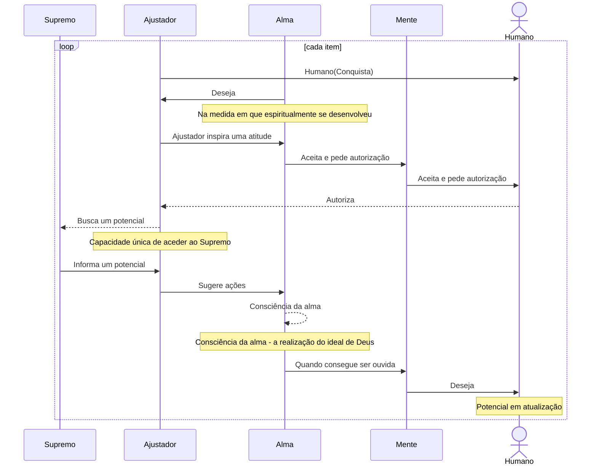

---

### Adoração

O processo de adoração é iniciado por um desejo da alma depois de mobilizar todos os poderes da personalidade humana (**<a href="javascript:showParagraph(5,3,7)" title="Abrir o parágrafo 5:3-7">5:3-7</a>**) sob domínio dela e é descrito como **"A mente mortal consente em adorar; a alma imortal anseia pela adoração e a inicia; a presença do Ajustador divino conduz essa adoração em nome da mente mortal e da alma imortal em evolução."** (**<a href="javascript:showParagraph(5,3,8)" title="Abrir o parágrafo 5:3-8">5:3-8</a>**).

   participant Ajustador
   Note over Ajustador: Espiritual
   participant Alma
   Note over Alma: Moroncial
   participant Mente
   Note over Mente: Intelectual
   actor Humano

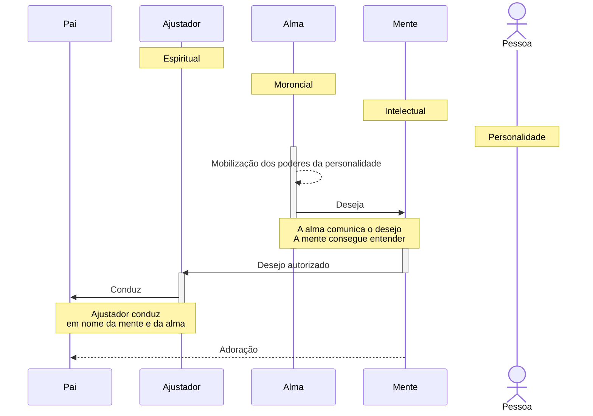

### Sete círculos

cf **<a href="javascript:showParagraph(49,6,8)" title="Abrir o parágrafo 49:6-8">49:6-8</a>**

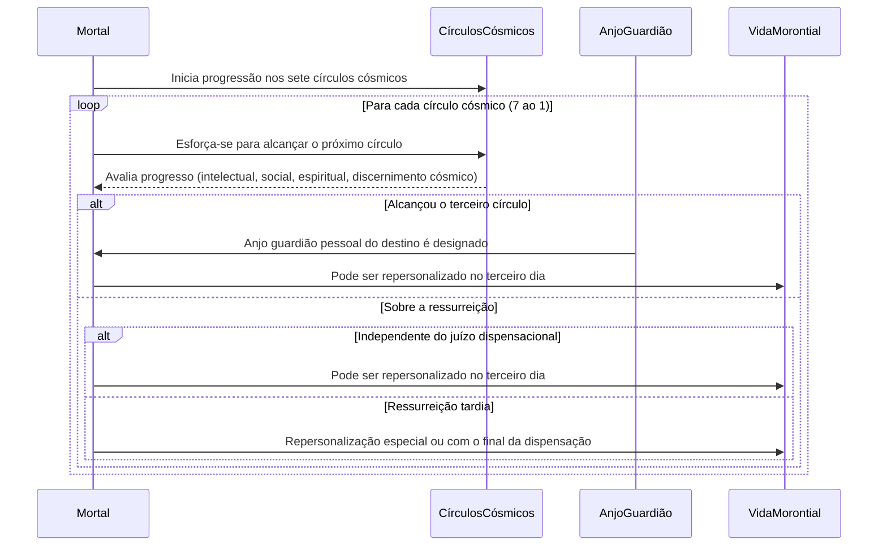

---

## Modelos

### 🧍 Participantes / Objetos

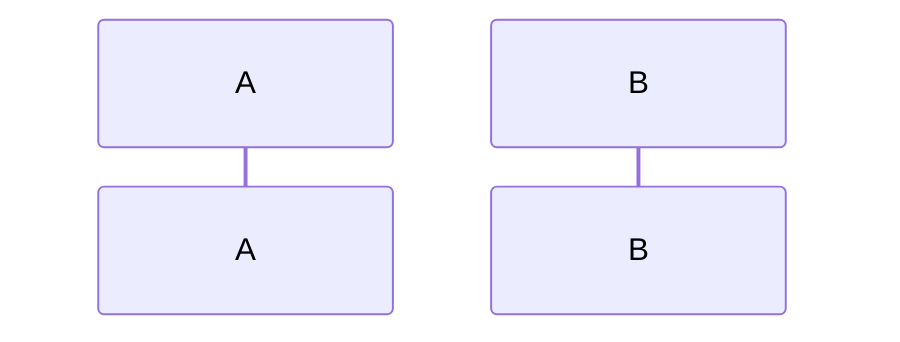

### ➡️ Mensagens (chamada de método)

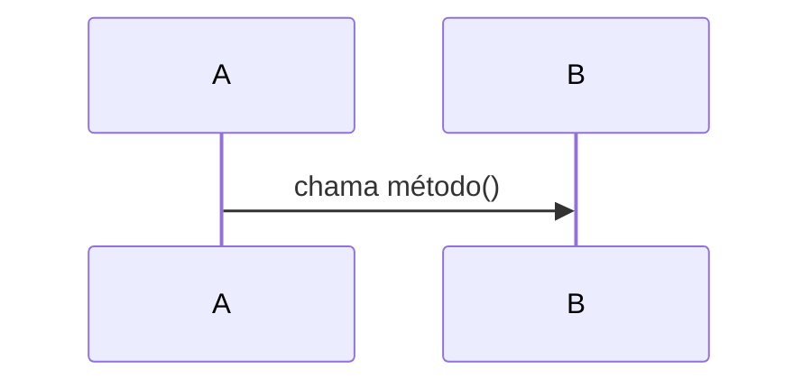

- `->>` é uma chamada síncrona  
- `-->>` é uma chamada assíncrona  

### 🔁 Retorno de chamada

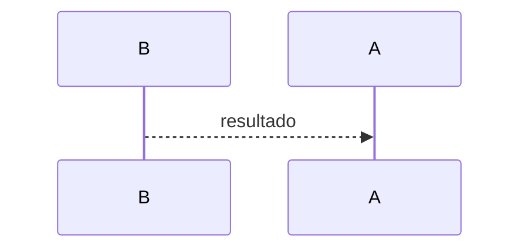

### 🔳 Ativação (implícita com chamadas)

Mermaid mostra barras de ativação automaticamente com chamadas síncronas (`->>`).

### 🔁 Loop

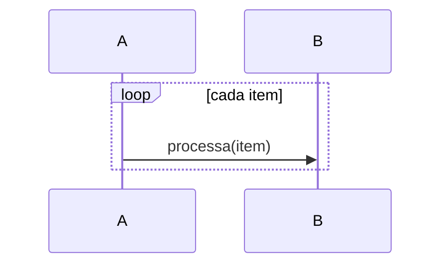

### 🔀 Alternativa (condicional)

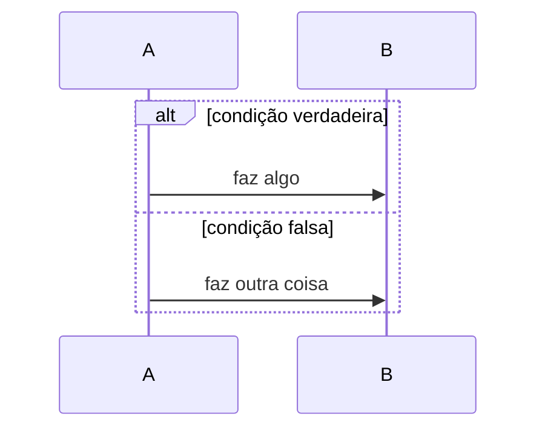

### ❓ Opção (tipo if sem else)

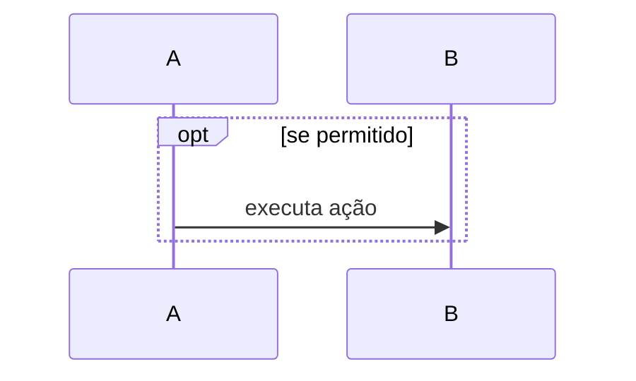

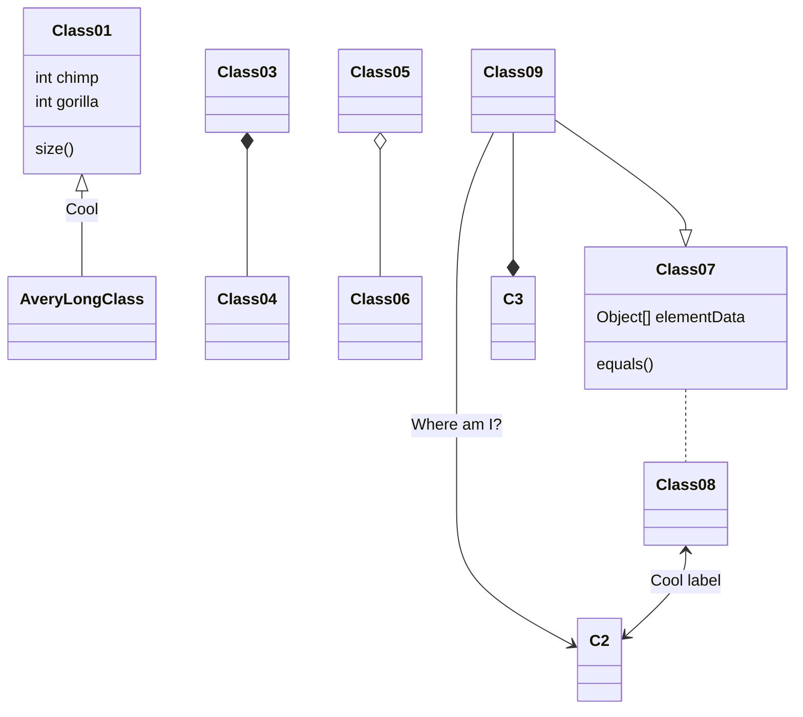

title: Simple sample

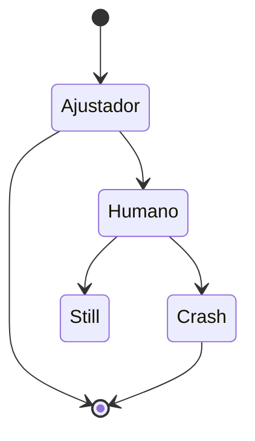

---
title: Order example

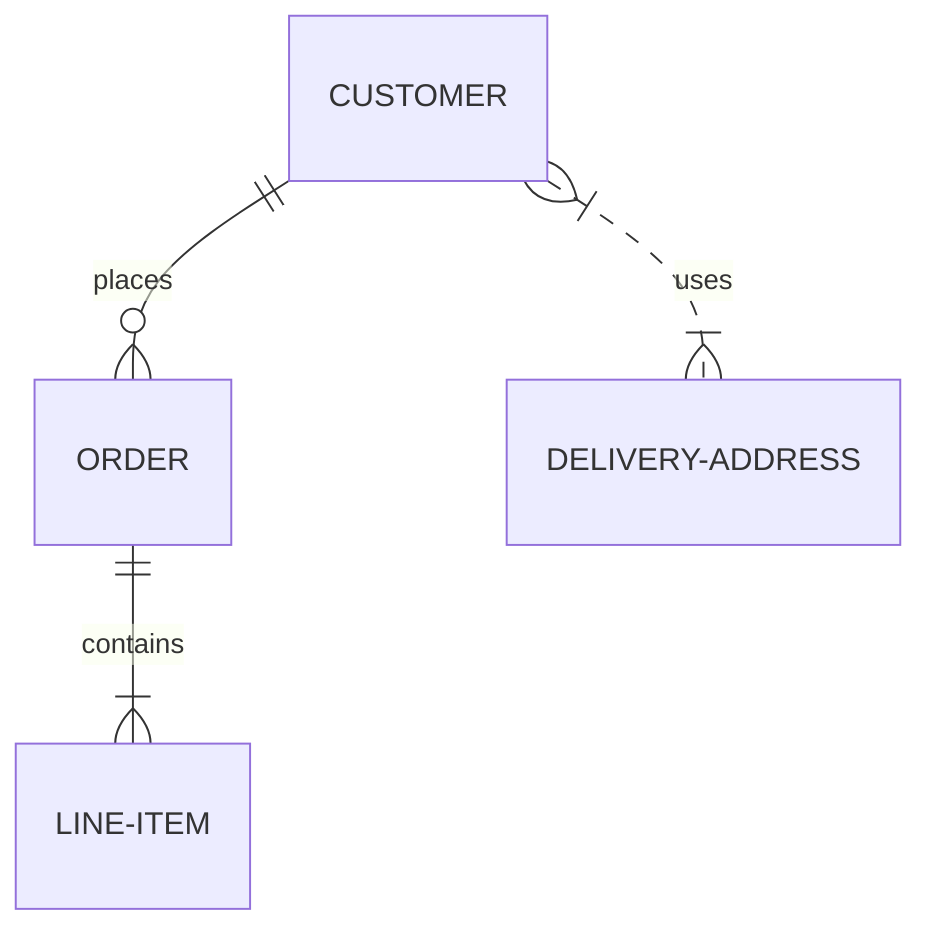

### Criando e removendo participantes

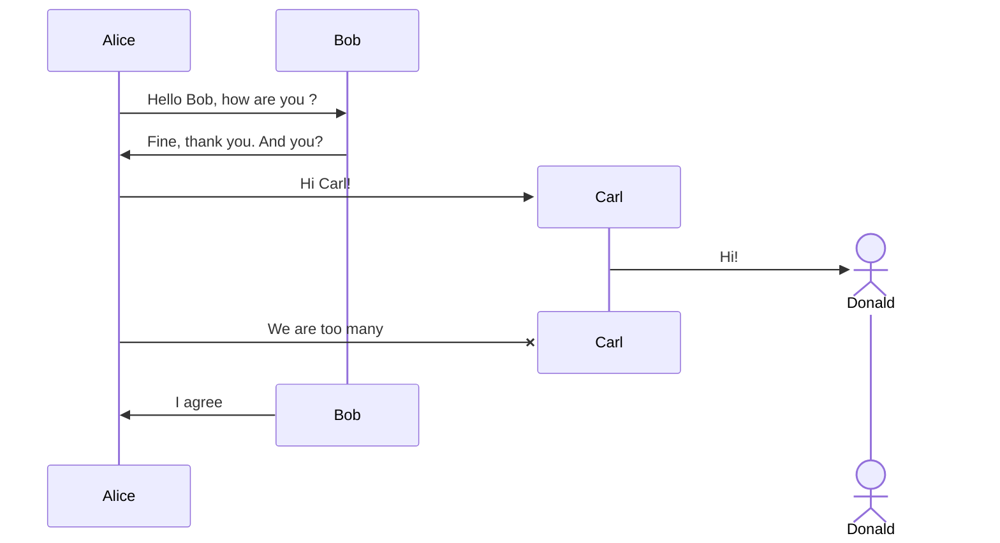
