# Dia a dia com o supremo

---

## Slide 1: Como o Ser Supremo pode enriquecer os meus dias?

```img
{ 
  "Imagem": { 
    "src": "assets/supremo_comigo/Slide1.png", 
    "title": "Como o Ser Supremo pode enriquecer os meus dias?", 
    "ident": "Fig. 1: Como o Ser Supremo pode enriquecer os meus dias?" 
  } 
} 
```

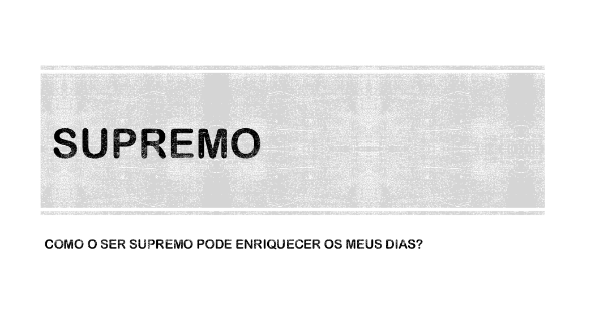

---

## Slide 2: Eventos na Eternidade

```img
{ 
  "Imagem": { 
    "src": "assets/supremo_comigo/Slide2.png", 
    "title": "Eventos na Eternidade", 
    "ident": "Fig. 2: Eventos na Eternidade" 
  } 
} 
```

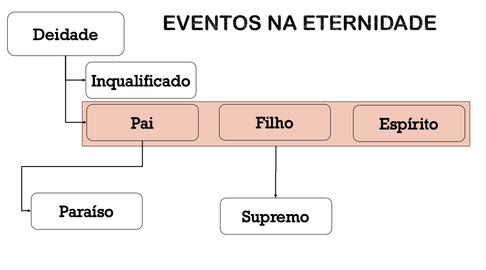

Supondo-se que as personalidades da Deidade tenham surgido numa ordem temporal antes de Havona e do Supremo, conforme licença solicitada pelo revelador como inevitável no parágrafo abaixo, o que não é verdade, pois estes são eventos eternos, mas a limitação mental de nós, humanos, os obriga a inserir o fator tempo no desdobramento da Deidade.

> ... Na tentativa de retratar a origem e a natureza da realidade universal, somos forçados a empregar a técnica do raciocínio espaço-tempo, de modo a atingir o nível da mente finita. Portanto, muitos eventos simultâneos na eternidade devem ser apresentados como transações seqüenciais. (**<a href="javascript:showParagraph(0,3,20)" title="Abrir o parágrafo 0:3-20">0:3-20</a>**)

---

## Slide 3: Potenciais para o Supremo

```img
{ 
  "Imagem": { 
    "src": "assets/supremo_comigo/Slide3.png", 
    "title": "Potenciais para o Supremo", 
    "ident": "Fig. 3: Potenciais para o Supremo" 
  } 
} 
```

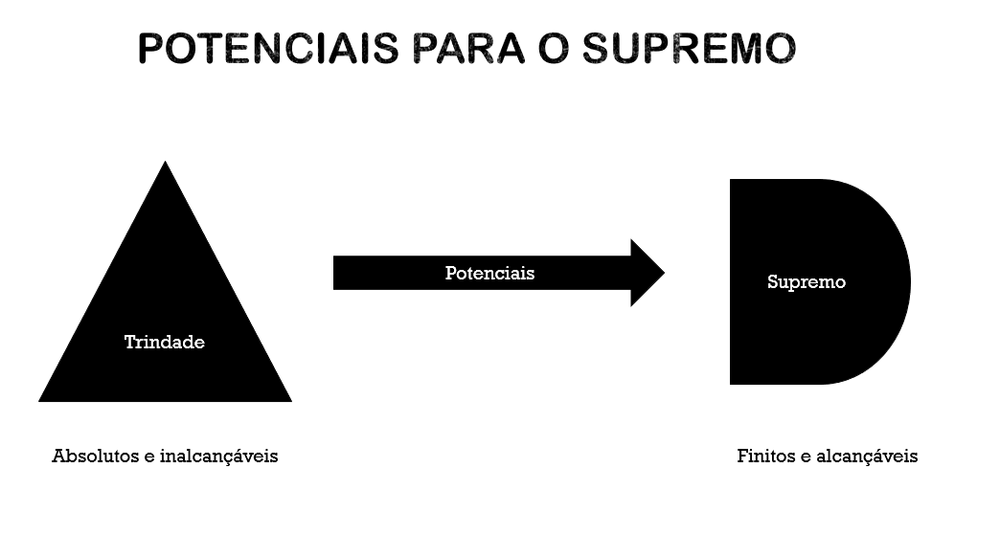

0:3-20 (5.19) REALIDADE, tal como compreendida pelos seres finitos, é parcial, relativa e vaga. O máximo de realidade da Deidade, plenamente compreensível pelas criaturas evolucionárias finitas, está abrangido no Ser supremo. Entretanto, há realidades antecedentes e eternas, realidades suprafinitas, que são ancestrais dessa Deidade Suprema das criaturas evolucionárias do espaço-tempo. Na tentativa de retratar a origem e a natureza da realidade universal, somos forçados a empregar a técnica do raciocínio espaço-tempo, de modo a atingir o nível da mente finita. Portanto, muitos eventos simultâneos na eternidade devem ser apresentados como transações seqüenciais.


O Supremo é uma deidade experiencial (**<a href="javascript:showParagraph(0,1,14)" title="Abrir o parágrafo 0:1-14">0:1-14</a>**) e não existencial (**<a href="javascript:showParagraph(0,4,9)" title="Abrir o parágrafo 0:4-9">0:4-9</a>**). Embora por vezes chamado de **Supremo** e em outras de **Todo-Poderoso**, ambos são uma única realidade, o Ser Supremo (**<a href="javascript:showParagraph(0,8,10)" title="Abrir o parágrafo 0:8-10">0:8-10</a>**). É também a unificação da Trindade da forma como esta pode ser compreendida pelos seres finitos (**<a href="javascript:showParagraph(0,9,2)" title="Abrir o parágrafo 0:9-2">0:9-2</a>**).

Os potenciais na Trindade são absolutos o que gera uma ilimitada, sem fim, possibilidade de crescimento para os seres pessoais (**<a href="javascript:showParagraph(115,3,17)" title="Abrir o parágrafo 115:3-17">115:3-17</a>**).

---

## Slide 4: Quantos Potenciais?

```img
{ 
  "Imagem": { 
    "src": "assets/supremo_comigo/Slide4.png", 
    "title": "Quantos Potenciais?", 
    "ident": "Fig. 4: Quantos Potenciais?" 
  } 
} 
```

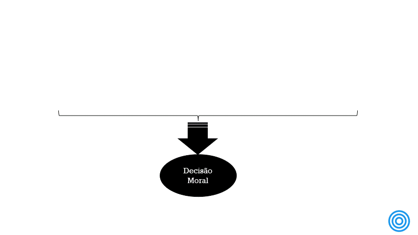

As decisões morais são influenciadas por uma complexa rede de fatores que interagem entre si e variam de pessoa para pessoa e de situação para situação. Esses fatores podem ser agrupados em diferentes categorias, cada uma destacando aspectos específicos que moldam o julgamento moral. Entre eles, estão os princípios **morais e éticos** individuais, as **influências sociais** e **culturais**, os **aspectos psicológicos** e **cognitivos**, além de considerações **legais**, **econômicas** e até **biológicas**. Abaixo, esses fatores são organizados por categorias para facilitar a compreensão da diversidade de elementos que podem pesar em uma decisão moral e apenas a título de exemplo, pois muitos mais fatores p+oderiam ser adicionados.

1. **Morais / Éticos**
   - Princípios éticos pessoais (honestidade, justiça, compaixão)
   - Códigos morais aprendidos (religiosos, filosóficos)
   - Consciência / senso de certo e errado
   - Grau de desenvolvimento moral

2. **Sociais**
   - Pressão social / influência de grupo
   - Expectativas familiares
   - Normas da comunidade ou sociedade
   - Exemplo ou julgamento de figuras de autoridade (pais, líderes, professores)
   - Consequências sociais (reputação, aprovação ou rejeição)

3. **Culturais**
   - Valores culturais predominantes (coletivismo vs. individualismo, por exemplo)
   - Tradições e costumes locais
   - Regras sociais não escritas (tabus, rituais)
   - Religião / crença espiritual dominante

4. **Psicológicos**
   - Empatia ou ausência dela
   - Nível de autocontrole
   - Estado emocional (raiva, medo, tristeza podem distorcer julgamentos)
   - Experiências passadas e traumas
   - Transtornos mentais ou de personalidade

5. **Cognitivos**
   - Capacidade de pensar nas consequências (curto e longo prazo)
   - Grau de informação ou conhecimento sobre a situação
   - Habilidades de raciocínio moral
   - Tendências cognitivas (viés de confirmação, dissonância cognitiva)

6. **Legais / Institucionais**
   - Leis vigentes (o que é legal ou ilegal)
   - Normas da escola, empresa ou instituição
   - Medo de punição ou desejo de recompensa
   - Época da vida

7. **Econômicos / Materiais**
   - Situação financeira
   - Interesse próprio ou vantagem pessoal
   - Risco de perda ou ganho material

8. **Biológicos / Instintivos**
   - Impulsos básicos (sobrevivência, proteção de familiares)
   - Instinto de autopreservação
   - Fatores hormonais ou neurológicos (ex: dopamina, cortisol)

---

## Slide 5: Quantos Potenciais?

```img
{ 
  "Imagem": { 
    "src": "assets/supremo_comigo/Slide5.png", 
    "title": "Quantos Potenciais?", 
    "ident": "Fig. 5: Quantos Potenciais?" 
  } 
} 
```

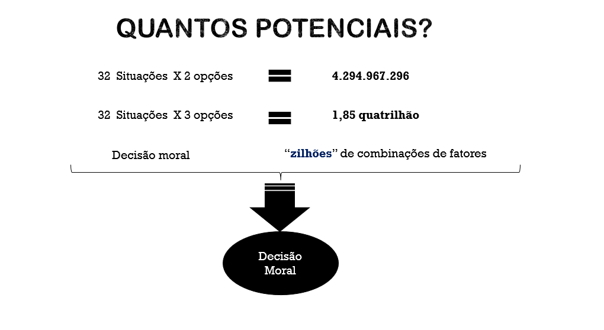

A combinação dos fatores, alguns elencados acima, que influenciam uma decisão moral é estramente grande, atingindo valores inimagináveis para nós. Cada pessoa reúne, de forma única, aspectos éticos, sociais, culturais, psicológicos, cognitivos, legais, econômicos e biológicos, que interagem entre si de maneiras distintas conforme o contexto. Isso significa que, mesmo diante da mesma situação, duas pessoas podem tomar decisões morais diferentes, baseadas em vivências, valores e percepções próprias. A complexidade dessas interações torna cada decisão moral um processo singular, moldado por um entrelaçamento dinâmico de influências internas e externas.

---

## Slide 6: Ser Supremo e Todo-Poderoso

```img
{ 
  "Imagem": { 
    "src": "assets/supremo_comigo/Slide6.png", 
    "title": "Ser Supremo e Todo-Poderoso", 
    "ident": "Fig. 6: Ser Supremo e Todo-Poderoso" 
  } 
} 
```


## Slide 7: O que é Necessário?

```img
{ 
  "Imagem": { 
    "src": "assets/supremo_comigo/Slide7.png", 
    "title": "O que é Necessário?", 
    "ident": "Fig. 7: O que é Necessário?" 
  } 
} 
```

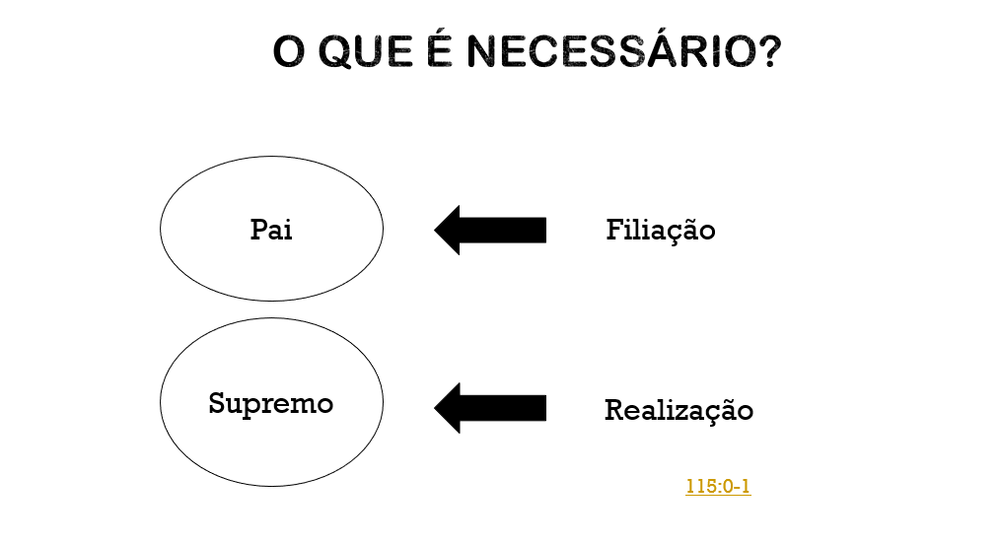

---

## Slide 8: Transformação Repentina?

```img
{ 
  "Imagem": { 
    "src": "assets/supremo_comigo/Slide8.png", 
    "title": "Transformação Repentina?", 
    "ident": "Fig. 8: Transformação Repentina?" 
  } 
} 
```

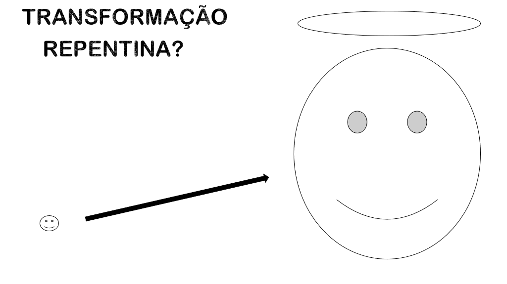

---

## Slide 9: Transformação Repentina?

```img
{ 
  "Imagem": { 
    "src": "assets/supremo_comigo/Slide9.png", 
    "title": "Transformação Repentina?", 
    "ident": "Fig. 9: Transformação Repentina?" 
  } 
} 
```

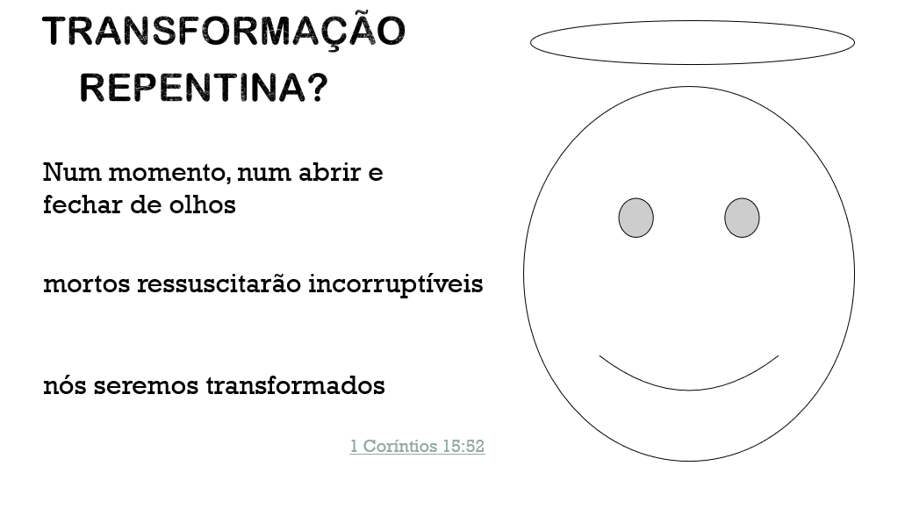

---

## Slide 10: Transformação Repentina?

```img
{ 
  "Imagem": { 
    "src": "assets/supremo_comigo/Slide10.png", 
    "title": "Transformação Repentina?", 
    "ident": "Fig. 10: Transformação Repentina?" 
  } 
} 
```

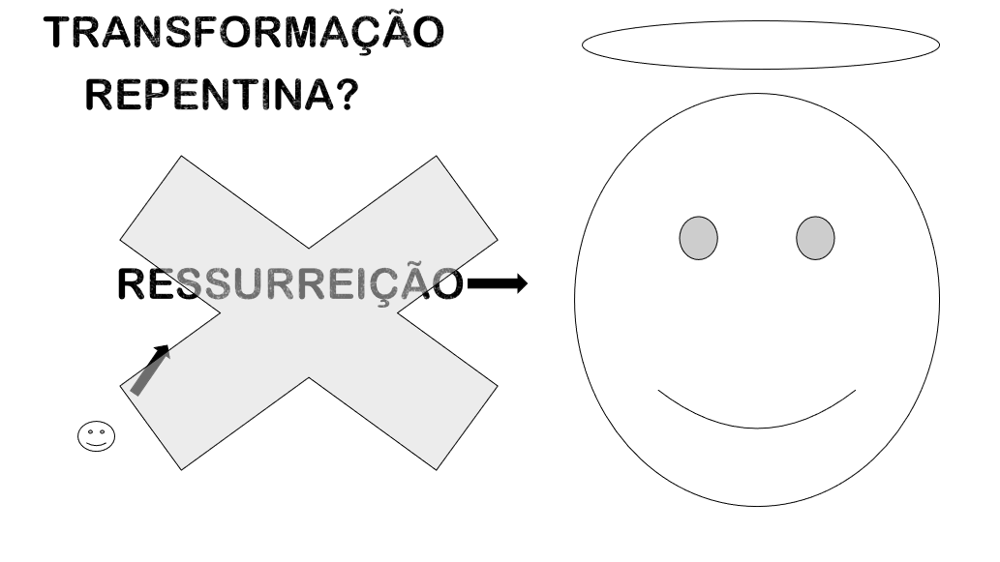

---

## Slide 11: Transformação Contínua

```img
{ 
  "Imagem": { 
    "src": "assets/supremo_comigo/Slide11.png", 
    "title": "Transformação Contínua", 
    "ident": "Fig. 11: Transformação Contínua" 
  } 
} 
```

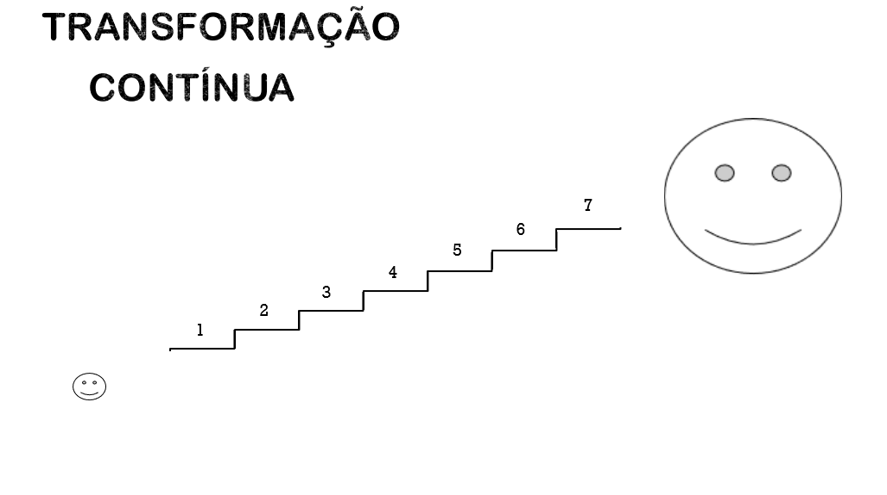

---

## Slide 12: Crescimento

```img
{ 
  "Imagem": { 
    "src": "assets/supremo_comigo/Slide12.png", 
    "title": "Crescimento", 
    "ident": "Fig. 12: Crescimento" 
  } 
} 
```

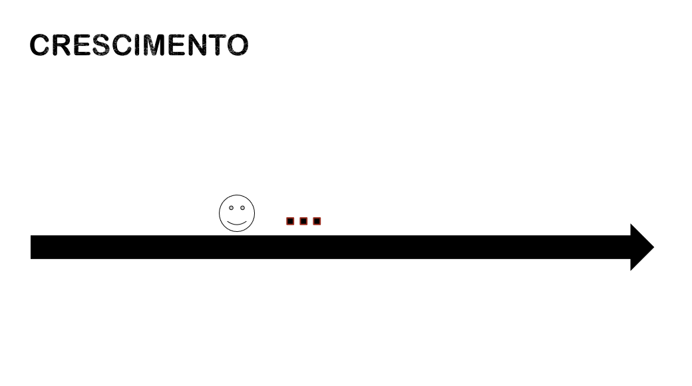

---

## Slide 13: Como se dá o Crescimento

```img
{ 
  "Imagem": { 
    "src": "assets/supremo_comigo/Slide13.png", 
    "title": "Como se dá o Crescimento", 
    "ident": "Fig. 13: Como se dá o Crescimento" 
  } 
} 
```

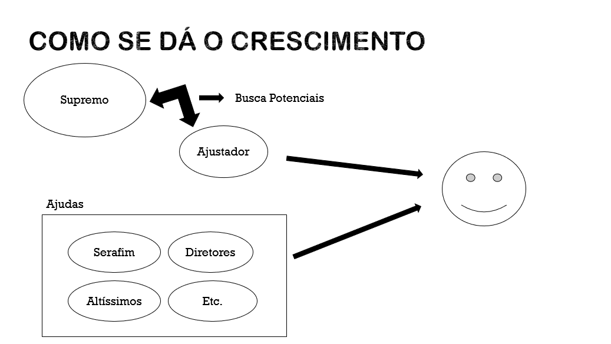

---

## Slide 14: Desenvolvimento dos Potenciais

```img
{ 
  "Imagem": { 
    "src": "assets/supremo_comigo/Slide14.png", 
    "title": "Desenvolvimento dos Potenciais", 
    "ident": "Fig. 14: Desenvolvimento dos Potenciais" 
  } 
} 
```

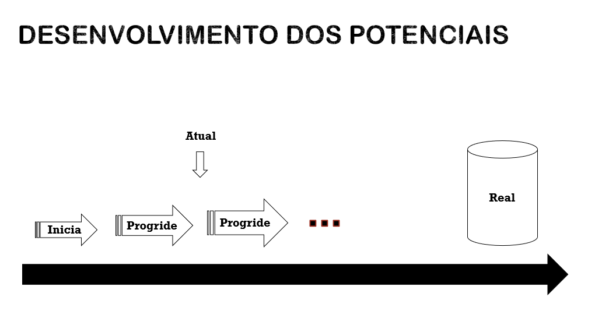

---

## Slide 15: Desenvolvimento dos Potenciais

```img
{ 
  "Imagem": { 
    "src": "assets/supremo_comigo/Slide15.png", 
    "title": "Desenvolvimento dos Potenciais", 
    "ident": "Fig. 15: Desenvolvimento dos Potenciais" 
  } 
} 
```

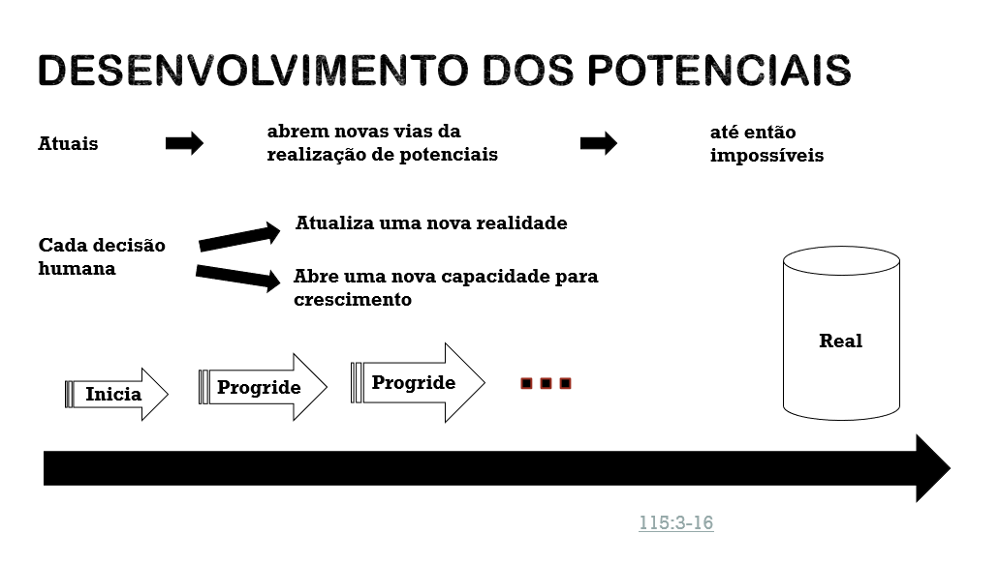

---

## Slide 16: Desenvolvimento dos Potenciais

```img
{ 
  "Imagem": { 
    "src": "assets/supremo_comigo/Slide16.png", 
    "title": "Desenvolvimento dos Potenciais", 
    "ident": "Fig. 16: Desenvolvimento dos Potenciais" 
  } 
} 
```

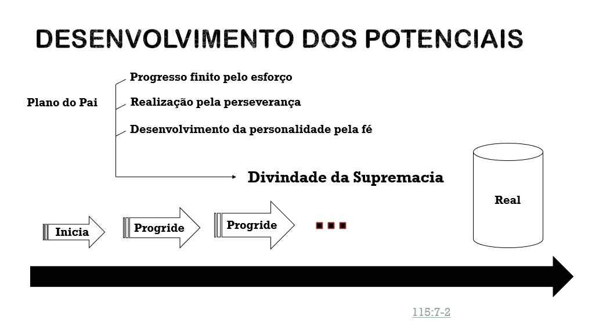

---

## Slide 17: O que pode Atrapalhar

```img
{ 
  "Imagem": { 
    "src": "assets/supremo_comigo/Slide17.png", 
    "title": "O que pode Atrapalhar", 
    "ident": "Fig. 17: O que pode Atrapalhar" 
  } 
} 
```

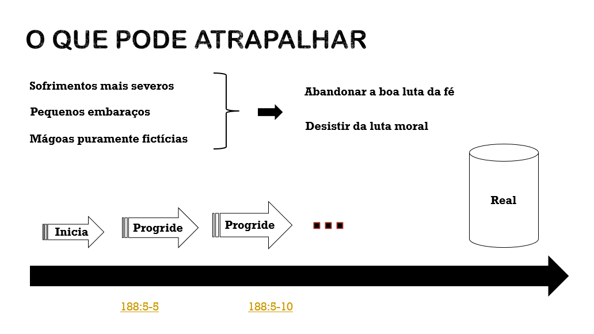

---

## Slide 18: Como Reagir

```img
{ 
  "Imagem": { 
    "src": "assets/supremo_comigo/Slide18.png", 
    "title": "Como Reagir", 
    "ident": "Fig. 18: Como Reagir" 
  } 
} 
```

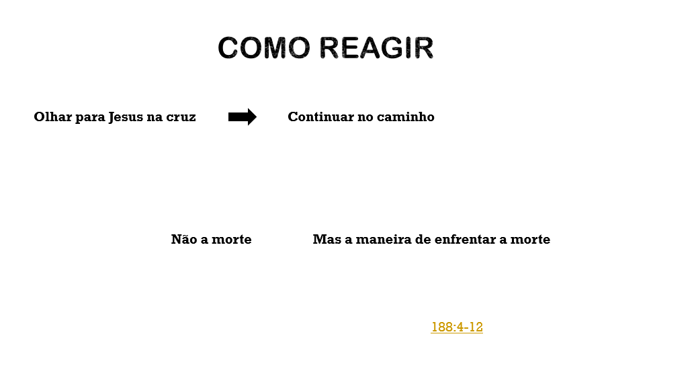

---

## Slide 19: Como Participar

```img
{ 
  "Imagem": { 
    "src": "assets/supremo_comigo/Slide19.png", 
    "title": "Como Participar", 
    "ident": "Fig. 19: Como Participar" 
  } 
} 
```

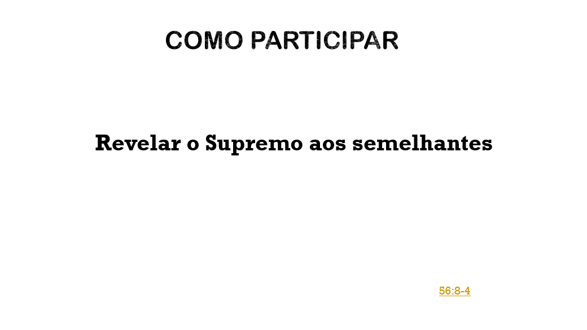

---

## Slide 20: Resposta

```img
{ 
  "Imagem": { 
    "src": "assets/supremo_comigo/Slide20.png", 
    "title": "Resposta", 
    "ident": "Fig. 20: Resposta" 
  } 
} 
```

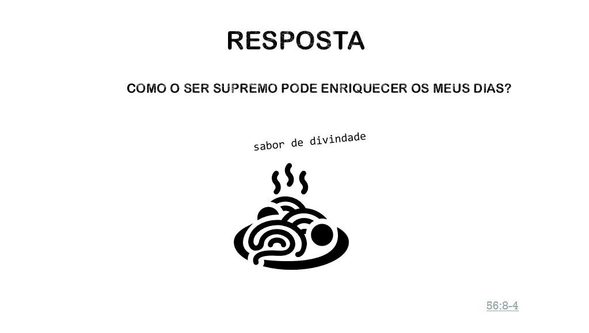

---

## Slide 6: Ser Supremo e Todo-Poderoso

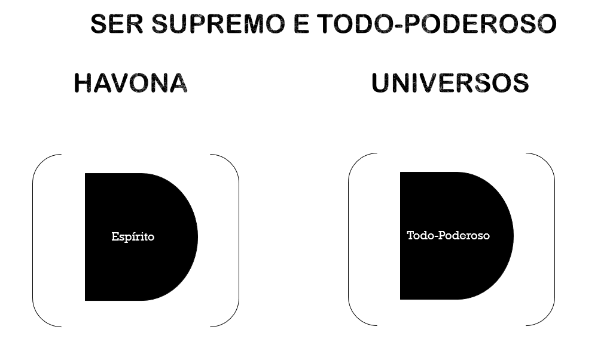

---

## Slide 7: Necessária realização


Este slide aborda uma distinção essencial entre dois níveis de relação com a divindade. No caso do **Pai Universal**, a simples conscientização da nossa **filiação divina** — e, por consequência inevitável, da **fraternidade de todos os homens** — é suficiente para estabelecer uma ligação espiritual significativa. No entanto, em relação ao **Ser Supremo**, essa conexão exige mais do que reconhecimento: requer **participação ativa**. É necessário colaborar conscientemente com a evolução do Supremo, contribuindo para a sua transição de uma atuação **impessoal e todo-poderosa** para uma **supremacia experiencial e pessoalizada** nos sete superuniversos (**<a href="javascript:showParagraph(115,0,1)" title="Abrir o parágrafo 115:0-1">115:0-1</a>**).

---

O Ser Supremo, existencialmente inexistente, emergiu como consequência do ato criativo e unificador da Trindade do Paraíso, a qual concentrou n’Ele todos os potenciais de realidade de Deidade que pudessem ser reduzidos a um nível finito.

---

**Texto sobre as calamidades**:

10:7-5 (115.7) A mente mortal pode imediatamente pensar em mil e uma coisas - eventos físicos catastróficos, acidentes espantosos, desastres horríveis, doenças dolorosas e flagelos mundiais - e perguntar se tais calamidades estão correlacionadas a manobras desconhecidas desse funcionamento provável do Ser Supremo. Francamente, não sabemos; não estamos realmente certos. Mas observamos que, à medida que o tempo passa, todas essas situações difíceis, e mais ou menos misteriosas, contribuem sempre para o bem-estar e o progresso dos universos. Pode ser que as circunstâncias da existência e as inexplicáveis vicissitudes da vida estejam todas entrelaçadas em um padrão significativo de alto valor pela função do Supremo e o supercontrole da Trindade.

**Proteção Angélica**:

113:3-6 (1244.7) Esta é uma exposição das funções múltiplas e intrincadas de um serafim guardião; mas como é que uma personalidade angélica subordinada, criada apenas um pouco acima do nível da humanidade no universo, faz coisas tão complexas e difíceis? Não sabemos realmente, mas conjecturamos que esse ministério fenomênico seja, de um modo não divulgado, facilitado pelo trabalho não revelado e não conhecido do Ser supremo, a Deidade em atualização dos universos em evolução do tempo e espaço. Através de todo o reino de sobrevivência progressiva, no Ser supremo e por meio dele, os serafins são uma parte essencial na continuidade da progressão dos mortais.


---

**Sugestão de Slides para Decisão Moral:**

Com certeza! Aqui está uma sugestão de slides para uma apresentação PowerPoint baseada nos parágrafos que você forneceu do Livro de Urântia, focando na evolução e no significado da verdadeira religião:

92:7-6 (1013-1) A qualidade de uma religião é indicada por:

Slide 1: Título
O Caminho da Verdadeira Religião: Da Consciência Material à Devoção Espiritual
Subtítulo: Insights do Livro de Urântia sobre a evolução da fé e o serviço a valores supremos.
Slide 2: A Religião Primitiva vs. A Civilização
A religião primitiva: Principalmente uma conscientização do valor material.
A civilização eleva os valores religiosos: Transforma a religião em devoção do eu ao serviço de valores significativos e supremos.
Conceito chave: A religião se torna menos sobre o "ter" e mais sobre o "ser" e o "servir".
Slide 3: A Evolução da Religião: Ética e Moralidade
Religião em evolução:
A ética se torna a filosofia dos costumes.
A moralidade se converte na disciplina do eu pelos padrões de significados mais elevados e valores supremos.
Em outras palavras: A fé deixa de ser apenas um conjunto de regras e se transforma em uma busca ativa por ideais espirituais e divinos.
Slide 4: A Essência da Verdadeira Religião
A verdadeira religião se transforma em:
Uma devoção espontânea e rara.
A experiência viva da lealdade do amor.
Reflexão: Não é um fardo, mas uma expressão natural e profunda do ser.
Slide 5: Qualidade da Religião: Níveis de Avaliação
Como identificar uma religião de qualidade?
1. Nível de valores — lealdades: A que e a quem somos leais? Quais são os nossos compromissos mais profundos?
2. Profundidade de significados: Quão sensível o indivíduo é à apreciação idealista desses valores mais elevados? É uma compreensão superficial ou profunda?
Slide 6: Qualidade da Religião: Intensidade e Progresso
Como identificar uma religião de qualidade? (continuação)
3. Intensidade da consagração: Qual o grau de devoção a esses valores divinos? É algo que realmente impulsiona a pessoa?
4. O progresso sem entraves da personalidade: O caminho cósmico de vida espiritual idealista leva à realização da filiação a Deus e à cidadania progressiva infinita no universo.
Slide 7: Conclusão - O Caminho Adiante
A verdadeira religião é um processo evolutivo de autoconhecimento e serviço.
Ela nos guia para a apreciação de valores supremos e a consecução de ideais divinos.
Nosso objetivo é a filiação a Deus e um progresso contínuo no universo.
Espero que esta estrutura seja útil para sua apresentação! Você pode adicionar imagens ou ícones relevantes para cada slide para torná-lo mais visualmente atraente.


Pelo fato de que um fim é apenas teórico, mas impossível na realidade, 
115:3-16 (1263.3) A dinâmica final do cosmo consiste na transferência contínua de realidade da potencialidade para atualidade. Em teoria, pode haver um final a essa metamorfose, mas de fato isso é impossível pois o potencial e o Atual estão ambos dentro do circuito do Original (o EU SOU) e essa identificação torna impossível para sempre colocar um limite na progressão do desenvolvimento do universo. Tudo o que é identificado com o EU SOU jamais pode ter um fim na progressão uma vez que a atualidade dos potenciais do EU SOU é absoluta e a potencialidadade dos atuais do EU SOU também é absoluta. Os atuais estarão sempre abrindo novas vias da realização de potenciais até então impossíveis — cada decisão humana não só atualiza uma nova realidade na experiência humana, mas também abre uma nova capacidade para crescimento humano. O homem vive em cada criança e o progressor moroncial reside no homem maduro conhecedor de Deus.


103:1-6 (1130.5) A realidade do reconhecimento de valores espirituais é uma experiência que é supra-ideacional. Não há palavra em nenhuma língua humana que possa ser empregada para designar esse “senso”, “sentimento”, “intuição” ou “experiência” que escolhemos para designar consciência de Deus. O espírito de Deus que reside no homem não é pessoal — o Ajustador é pré-pessoal —, mas este Monitor apresenta um valor, exala um sabor de divindade, que é pessoal no mais elevado e infinito sentido. Se Deus não fosse ao menos pessoal, ele não poderia ser consciente e se não consciente, ele seria então infra-humano.


trends influence of on man's philosophy of religion|**<a href="javascript:showParagraph(101,7,1)" title="Abrir o parágrafo 101:7-1">101:7-1</a>**|Uma ideia é apenas um plano teórico para  ação, enquanto uma decisão positiva é um plano validado de ação. Um estereótipo é um plano de ação aceito sem validação. Os materiais para construir uma filosofia pessoal de religião são derivados tanto das experiências interior quanto da ambiental do indivíduo. O status social, as condições econômicas, oportunidades educacionais, inclinações morais, influências institucionais, desenvolvimentos políticos, tendências raciais e ensinamentos religiosos do tempo e lugar de uma pesssoa tornam-se todos fatores na formulação de uma filosofia pessoal de religião. Mesmo o temperamento inerente e a inclinação intelectual determinam marcadamente o padrão da filosofia religiosa. Vocação, casamento e parentesco influenciam todos a evolução dos padrões pessoais de vida.|

A origem do sentimento de culpa (**<a href="javascript:showParagraph(103,4,3)" title="Abrir o parágrafo 103:4-3">103:4-3</a>**).
ideals man's highest comparison of with the will of God||O sentimento de culpa (não a consciência do pecado) vem ou da comunhão espiritual interrompida ou do rebaixamento dos ideais  morais do indivíduo. A libertação desse apuro somente pode advir pela compreensão de que os ideais morais mais elevados da pessoa não são necessariamente sinônimos da vontade de Deus. O homem não pode esperar viver à altura dos seus ideais mais elevados, mas ele pode ser fiel ao seu propósito de encontrar Deus e tornar-se cada vez mais como ele.

**<a href="javascript:showParagraph(56,10,20)" title="Abrir o parágrafo 56:10-20">56:10-20</a>**|A verdade, a beleza e a bondade abrangem, para o homem finito, toda a revelação da realidade divina. À medida que esse amor-compreensão da Deidade encontra expressão espiritual, nas vidas dos mortais cientes de Deus, os frutos da divindade são alcançados: paz intelectual, progresso social, satisfação moral, alegria espiritual e sabedoria cósmica. Os mortais avançados em um mundo no sétimo estágio de luz e vida aprenderam que o amor é a maior de todas as coisas do universo — e sabem que Deus é amor.|

---

A Ordem de Surgimento da Trindade do Paraíso, do Absoluto Inqualificado e do Paraíso no Livro de UrântiaIntrodução:

O Livro de Urântia apresenta-se como uma obra abrangente que aborda questões fundamentais sobre Deus, o universo e o lugar da humanidade dentro dele.

1. Afirma ser uma quinta revelação de época, com o objetivo de apresentar conceitos ampliados e verdades avançadas.1 O livro procura unificar religião, ciência e filosofia, oferecendo uma cosmologia detalhada.

2. A Parte I do livro aborda especificamente os universos central e superuniversos, incluindo o Pai Universal, a Trindade do Paraíso e a Ilha do Paraíso.1Esta análise visa responder à questão específica sobre a "ordem de surgimento" da Trindade do Paraíso, do Absoluto Inqualificado e do Paraíso, incluindo implicitamente o Pai Universal dentro da Trindade. Contudo, é crucial reconhecer que o Livro de Urântia descreve essas entidades como fundamentais e, em grande parte, eternas, tornando a aplicação de uma estrita "ordem de surgimento" temporal um conceito complexo.3 A Trindade do Paraíso é descrita como "original e eterna", "sem começo" e "existencial".

3. O Paraíso é declarado como sendo "da eternidade", sem quaisquer registos da sua origem.

5 Os três membros da Trindade também são descritos como "existentes desde a eternidade".7Assim, o objetivo deste relatório é explorar as relações e as prioridades fundacionais entre estas realidades cósmicas, conforme descrito no Livro de Urântia, em vez de se concentrar numa sequência temporal linear de surgimento. É provável que a questão do utilizador, embora formulada em termos de "ordem de surgimento", procure compreender as relações fundamentais e a primazia relativa destes elementos cosmológicos centrais dentro da estrutura do Livro de Urântia. Dada a ênfase do Livro de Urântia na natureza eterna destas entidades, uma ordem cronológica simples é improvável. O utilizador está mais provavelmente interessado numa compreensão hierárquica ou fundacional de como estas realidades se relacionam umas com as outras.A Primazia do EU SOU:O conceito do EU SOU é apresentado como a fonte última e inqualificada de toda a realidade, a premissa fundacional da cosmologia do Livro de Urântia.

9 O EU SOU é descrito como o Infinito, abrangendo tudo o que poderia alguma vez existir numa eternidade infinita.

9 É o "postulado filosófico primordial" para compreender a origem e o destino da realidade.9 Como um conceito existencial, o EU SOU transcende as categorizações finitas típicas.9Toda a realidade, incluindo as três pessoas existenciais da Deidade (Pai Universal, Filho Eterno, Espírito Infinito), a Ilha do Paraíso e os três Absolutos, tem a sua origem no EU SOU.9 O EU SOU é descrito como sendo "pai do Filho Eterno" e "causa do Paraíso eterno", indicando uma relação fundacional.9 O Absoluto Inqualificado é apresentado como o aspeto "estático-reativo" ou a "presença de supergravidade" do EU SOU.9 O EU SOU representa a potencialidade indiferenciada do infinito, precedendo e subjacente a toda a realidade manifestada, incluindo a Trindade, o Paraíso e os Absolutos. É a fonte da qual tudo o mais emana ou se diferencia. O Livro de Urântia posiciona consistentemente o EU SOU como a fonte última. As descrições da Trindade, do Paraíso e dos Absolutos como derivados ou como aspetos do EU SOU estabelecem uma clara prioridade fundacional.A Trindade Existencial do Paraíso:A Trindade do Paraíso, a união eterna do Pai Universal, do Filho Eterno e do Espírito Infinito, tem a sua origem inerente no ato do Pai Universal de diferenciar o pessoal e o não pessoal pela sua vontade ilimitada, factualizada quando a sua vontade pessoal coordenou estas realidades duais pela mente.3 O Filho Eterno é descrito como o Filho "unigénito", recebendo a "personalidade da infinitude" do Pai.4 O Espírito Infinito é explicado como o "Ator Conjointo", recebendo a "personalidade conjunta" da união eterna do Pai e do Filho.4 Os três membros da Trindade são de natureza coordenada, coigual e coeterna.4 A Trindade do Paraíso é considerada "existencial" e "inevitável" nos assuntos do universo.

- 3 É identificada como a "tese eterna", uma realidade fundacional no "Prólogo na Eternidade".13O propósito funcional da Trindade inclui facilitar a expressão e a revelação da natureza eterna da Deidade pelo Pai e proporcionar uma "fuga do absolutismo da personalidade".4 A Trindade do Paraíso é a base para o surgimento de outras realidades da Deidade, como Deus o Supremo, o Último e o Absoluto.
- 3 A Trindade do Paraíso não é apresentada como surgindo após o Paraíso ou o Absoluto Inqualificado, mas sim como uma realidade coeterna que surge dos atos volitivos iniciais do Pai Universal dentro do contexto do EU SOU preexistente. Os três membros são interdependentes e coiguais.A Ilha Eterna do Paraíso:A Ilha do Paraíso é descrita como o núcleo eterno e central do universo dos universos.1 A sua natureza intemporal e sem espaço é enfatizada, existindo fora da estrutura convencional dos universos.16 Possui uma natureza dual como uma esfera material (Paraíso inferior, o centro da gravidade física) e uma morada espiritual (Paraíso superior, a localização da personalidade absoluta da Deidade).5 O Paraíso é "da eternidade", sem registos de origem, indicando a sua existência primordial juntamente com as Deidades.5 Desempenha o papel de fonte e substância da gravidade física e de estabilizador universal.16 O Paraíso é a fonte eterna de todos os universos materiais, embora isto seja descrito como um "evento da eternidade", não uma criação temporal.27 As sete esferas sagradas do Pai, do Filho e do Espírito, que também são descritas como eternas, estão em estreita proximidade com o Paraíso.6 O Paraíso é apresentado como uma realidade coeterna com a Trindade, não algo criado por ela ou existente antes num sentido temporal. As suas características únicas e os seus papéis fundamentais na gravidade e como morada da Deidade sublinham a sua importância primária na cosmologia de Urântia.O Absoluto Inqualificado:O Absoluto Inqualificado é descrito como a realidade última, sem começo, sem fim, atemporal e sem espaço, transcendendo até mesmo o Último.2 A sua natureza é explicada como "potencialidade espacial", a presença livre no espaço que subjaz ao potencial para a criação do universo.27 Desempenha um papel na sustentação do universo físico e está ligado à força primordial e ao surgimento da energia.27 É descrito como o aspeto "estático-reativo" do EU SOU, representando a matriz infinita e o potencial para a expansão cósmica.9 A sua presença é notada na "Era Zero" pré-criacional.36 Distingue-se do Absoluto da Deidade (potencial do espírito) e do Absoluto Universal (unificador das realidades da deidade e não deificada).19 A força emerge do domínio exclusivo do Absoluto Inqualificado.27 O Absoluto Inqualificado não é apresentado como tendo um ponto de "surgimento", mas sim como uma condição eterna e fundamental da infinitude, uma potencialidade preexistente que subjaz e torna possíveis todas as manifestações subsequentes da realidade. Existe juntamente com o EU SOU, a Trindade e o Paraíso como um elemento fundacional do cosmos.A Inter-relação e a Ordem:As relações entre estas realidades cósmicas fundamentais são complexas e frequentemente não lineares.3 O EU SOU é a fonte última, a infinitude indiferenciada que precede e engloba tudo.9 Dentro do contexto do EU SOU, o Pai Universal inicia a diferenciação que leva à Trindade do Paraíso, uma união coeterna de três personalidades divinas.3 O Paraíso é uma realidade coeterna com a Trindade, servindo como a morada central da Deidade e o núcleo do universo, com propriedades únicas fora do tempo e do espaço.5 O Absoluto Inqualificado é uma potencialidade eterna e fundamental da infinitude, associada à potencialidade espacial e à fonte da força, existindo juntamente com estas outras realidades.9 O Absoluto Universal atua como uma força mediadora entre o Absoluto da Deidade (relacionado com o Deus pessoal) e o Absoluto Inqualificado (relacionado com o potencial impessoal).19 O Livro de Urântia enfatiza as prioridades lógicas e fundacionais em vez de uma estrita sequência temporal de "surgimento" para estas realidades eternas. A vontade do Pai é primária no contexto da Trindade, e o EU SOU é a fonte última de tudo, mas a sua existência é amplamente descrita como coeterna.A cosmologia do Livro de Urântia sugere uma estrutura fundacional onde o EU SOU é primordial, seguido pelas realidades coeternas e interdependentes da Trindade do Paraíso e do Paraíso. O Absoluto Inqualificado é melhor compreendido como uma condição ou potencialidade eterna que subjaz e interage com estas realidades manifestadas. Não existe uma única ordem linear de "aparição" num sentido temporal.Conclusão:O Livro de Urântia descreve a Trindade do Paraíso, o Absoluto Inqualificado e o Paraíso como realidades fundamentais e eternas dentro da sua cosmologia. O conceito de uma estrita "ordem de surgimento" temporal não é diretamente aplicável a estas entidades. O EU SOU representa a fonte última, com a Trindade do Paraíso e o Paraíso a existirem como manifestações coeternas e interdependentes da Deidade. O Absoluto Inqualificado é uma potencialidade eterna e subjacente que interage e sustenta o cosmos manifestado.Tabela 1: Características Principais da Trindade do Paraíso, do Absoluto Inqualificado e do Paraíso:EntidadeNaturezaOrigemStatus de Tempo/EspaçoFunções/Papéis PrimáriosTrindade do ParaísoUnião Eterna da DeidadeVontade do Pai dentro do EU SOUExistencialFacilita a vontade do Pai, base para outras Deidades, proporciona uma fuga do absolutismo da personalidade.Absoluto InqualificadoRealidade sem Começo/FimAspeto Existencial do EU SOUAtemporal/Sem EspaçoSubjaz ao potencial para a criação do universo, sustenta o universo físico, fonte da força primordial.ParaísoIlha EternaDa EternidadeAtemporal/Sem EspaçoMorada da Deidade, centro da gravidade física, fonte do universo material, estabilizador universal.

